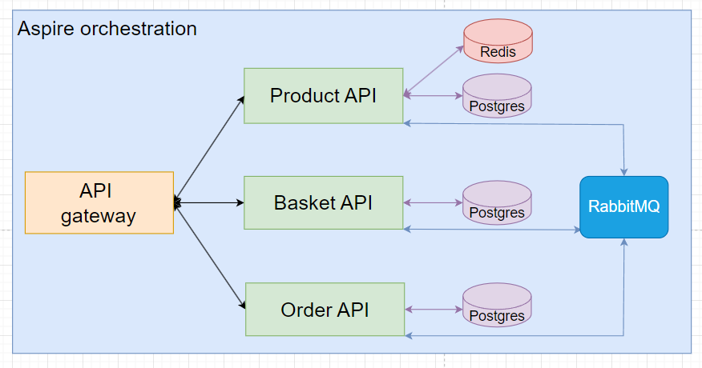

<h1 align="center">
  </a>
</h1>

<h2 align="center">.NET 8 microservice reference implementation</h2>

  <a href="#about">About</a> ◈
  <a href="#architecture">Architecture</a> ◈
  <a href="#prerequisites">Prerequisites</a> ◈
  <a href="#build-and-run">Build and run</a> ◈
  <a href="#roadmap">Roadmap</a>

## About

This project showcases one of many possible implementations of [microservices](https://microservices.io/) in .NET 8. 
It incorporates a range of tools and technologies, including [PostgreSQL](https://www.postgresql.org/) for data storage, 
[Entity Framework Core](https://docs.microsoft.com/en-us/ef/core/) as the ORM, [Redis](https://redis.io/) for caching, 
and [RabbitMQ](https://www.rabbitmq.com/) with [MassTransit](https://masstransit.io/) for event-based communication 
between microservices. Logging is handled by [Serilog](https://serilog.net/), unit testing 
uses [Moq](https://github.com/devlooped/moq), and API gateways 
and [.NET Aspire](https://learn.microsoft.com/en-us/dotnet/aspire/get-started/aspire-overview) are used to 
orchestrate the application.

**The main purpose of the project is to be used as a reference implementation in
case of need.**

## Architecture
A high-level overview of the system looks like this:

  

It includes several key components:
- **API Gateway**: A centralized entry point into the system. Its main role is to route external requests to internal APIs.
- **Product API**: A microservice following the VSA architecture. It uses Redis for data caching and its own PostgreSQL database for storage. Additionally, it publishes data to the RabbitMQ message queue.
- **Basket API**: A microservice following the VSA architecture. It consumes messages from RabbitMQ.
- **Order API**: A microservice following the VSA architecture. It consumes messages from RabbitMQ.
- **Aspire Orchestration**: All three APIs, PostgreSQL, Redis, and RabbitMQ are orchestrated using .NET Aspire.

Each of the APIs is built using the Vertical Slice Architecture (VSA), organizing features into cohesive, 
independently functioning slices.

  

- **Controllers**: The highest layer within an API, consisting of controllers whose job is to receive HTTP requests and return responses. This layer forwards the request data to the service layer using [dependency injection (DI)](https://learn.microsoft.com/en-us/dotnet/core/extensions/dependency-injection).
- **BL**: The **Business Logic (BL)** layer, sometimes called the "service layer," contains all the application's business logic. A service in this layer mostly receives calls from other services within the same layer or from controllers via DI. If necessary, it can call a repository in the DAL to fetch data from the database. This layer is decoupled from the DAL, meaning it is not aware of how or where the DAL layer retrieves data.
- **DAL**: The **Data Access Layer (DAL)** is where all the queries to the database reside. The repository pattern is used in this layer.

## Prerequisites
TBD

## Build and run
TBD

## Roadmap

- [x] Initial system architecture
- [x] .NET Aspire configured
- [x] Product API architecture
- [x] Basket API architecture
- [ ] Order API architecture
- [ ] API gateway implemented
- [ ] Redis caching implemented
- [x] MassTransit configured
- [x] RabbitMQ integrated
- [x] Serilog logging
- [x] PostgreSQL integrated
- [x] EntityFramework configured
- [ ] TBD, many many more